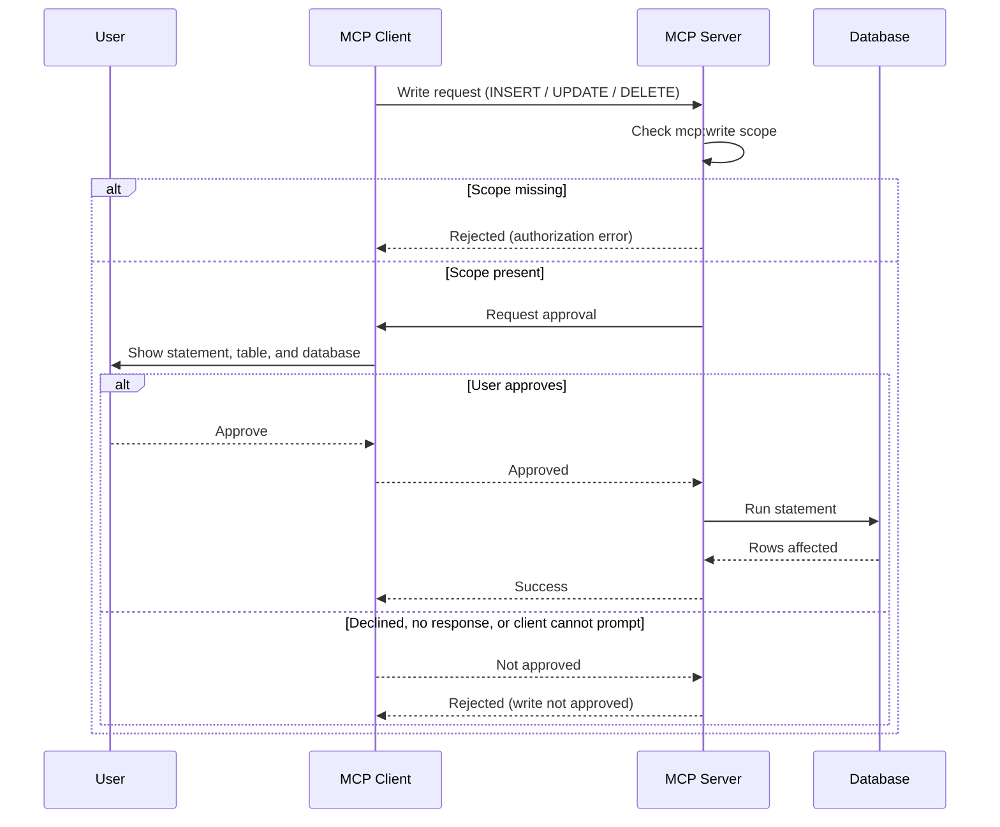

# Write Support

By default, the Actian MCP Server permits only read queries. Set `query_mode` to `read-write` in `conf.json` to also allow Data Manipulation Language (DML) statements, that is `INSERT`, `UPDATE`, and `DELETE`.

Write support remains off until it is enabled. Existing read-only deployments are not affected.

Extensions can write too, through the same authorization checks described below. See [Extensions](extensions/index.md).

For which tools accept a write, and how, see [HCL Informix tools](tools/index.md). The `query_mode` setting and the authorization checks described below apply the same way regardless of which tool performs the write.

## Enabling Write Mode

Set `query_mode` in the `conf.json` file:

| Value | Behavior |
|-------|----------|
| `read-only` | Default. Only read queries are permitted. |
| `read-write` | Read queries plus `INSERT`, `UPDATE`, and `DELETE` are permitted. |

```json
{
  "query_mode": "read-write"
}
```

!!! note "Data Definition Language is always blocked"
    Enabling write mode does not permit Data Definition Language (DDL) or administrative statements. `CREATE`, `ALTER`, `DROP`, and `GRANT` are rejected, and so are `SET`, `ENABLE`, `DISABLE`, and `SELECT ... INTO`. This is not configurable. Use the database's native tools for schema changes.

## Authorizing a Write

Writes require `"query_mode": "read-write"` in `conf.json`. In that mode, every DML statement must pass two independent checks before it reaches the database. Either one can reject it.

| Check | What it requires | When it applies |
|-------|------------------|-----------------|
| `mcp:write` scope | The access token must carry the `mcp:write` scope. | Only when OAuth is enabled. A read-only server never requests or requires this scope. |
| Human approval | A person must approve the statement in the connected client. | Always, unless disabled with `write_confirmation`. |

The scope is checked first, so a caller without it is rejected before anyone is asked to approve anything.



The approval prompt uses the Model Context Protocol (MCP) elicitation capability, which not every client implements. If the connected client cannot display the prompt, the write is rejected, exactly as if a person had declined it. See [Connecting MCP Clients](../mcp-clients/index.md#elicitation-support-for-write-approval) for which clients support it.

To configure the `mcp:write` scope in the identity provider, see [Auth0](authentication/auth0.md) or [Keycloak](authentication/keycloak.md).

## Skipping the Approval Prompt

Some clients cannot display the approval prompt. For those deployments, set `write_confirmation` to `false` in `conf.json` to run the server's built-in write tools without asking for approval:

```json
{
  "query_mode": "read-write",
  "write_confirmation": false
}
```

!!! warning "This removes human oversight of every write"
    With `write_confirmation` set to `false`, the server runs `INSERT`, `UPDATE`, and `DELETE` statements as soon as they are requested. Nobody is asked first. Use it only when the client cannot prompt and unattended writes by the AI agent are acceptable.

    The `mcp:write` scope check still applies. Disabling the prompt does not grant write access to callers that lack the scope.

    This setting covers the built-in write tools only. An extension that asks for approval itself always prompts, whatever this is set to. See [Extensions](extensions/index.md#extension-security-controls).

The server records what it skipped. At startup it logs a warning banner stating that write confirmation is disabled, and it logs a warning for each write that ran without approval. Those entries name the tool only. They never include the statement text or the row values.

## Next Steps

<div class="grid cards" markdown>

- :material-database-cog: **[HCL Informix® configuration](index.md#configuration-reference)**  
  The `query_mode` and `write_confirmation` fields for HCL Informix®.

- :material-shield-check: **[Authentication](authentication/index.md)**  
  Set up the `mcp:write` scope in Auth0 or Keycloak.

- :material-connection: **[MCP clients](../mcp-clients/index.md#elicitation-support-for-write-approval)**  
  Which clients can display the write approval prompt.

</div>
