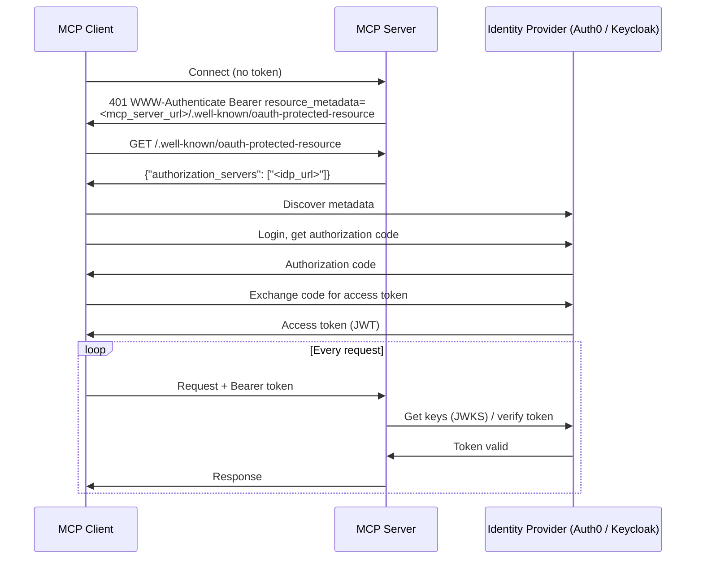

# Configuring Authentication

The Actian MCP Server for Actian NoSQL supports OAuth 2.0 and OpenID Connect (OIDC) authentication. When this feature is enabled, every client request must include a valid JSON Web Token (JWT) issued by a trusted identity provider (IdP).

!!! info "Database credentials vs. OAuth:"
    There are two distinct types of authentication used by the system:

     - **Database credentials:** The `user:password` portion of the NoSQL connection URL (for example, `cars@localhost#admin:secret`) is used to authenticate with the database itself when the server starts.
     - **OAuth 2.0:** This protocol controls access to the MCP Server endpoint.

## Working with OAuth

Authentication is disabled by default. When enabled, all `/mcp/*` endpoints require a valid Bearer token issued by an OIDC provider. The server acts as an OAuth 2.0 resource server and exposes a resource metadata endpoint at `/.well-known/oauth-protected-resource`. MCP clients use this endpoint to discover the identity provider and initiate the appropriate OAuth flow.

The server supports two primary flows:

- **Authorization Code:** Used for interactive clients (such as Claude Desktop, Cursor, and the FastMCP Python client). The client redirects the user to the IdP for login and receives a token after consent.
- **Client Credentials:** Used for machine-to-machine (M2M) scenarios where no user interaction is possible. The client authenticates directly with the IdP using its own credentials.

The diagram below illustrates the Authorization Code flow:



### Configuration

| Property | Required | Description |
|---|---|---|
| `mcp.auth.enabled` | Yes (to enable) | Set to `true` to enable OAuth2 authentication. Disabled by default. |
| `quarkus.oidc.auth-server-url` | Yes (if enabled) | Issuer URL of your OIDC provider, for example, `https://your-idp.example.com/`. |
| `quarkus.oidc.sse-tenant.auth-server-url` | No | Overrides the OIDC provider for the SSE endpoint (`/mcp/sse`) only. Defaults to `quarkus.oidc.auth-server-url`. |
| `quarkus.oidc.resource-metadata.scopes` | Depends on the provider | The scopes the server publishes as `scopes_supported` in its resource metadata, comma-separated. MCP clients read this list and request exactly those scopes. A Keycloak deployment should always set it; an Auth0 deployment needs it only in write mode. See [Advertising scopes to MCP clients](#advertising-scopes-to-mcp-clients). |

!!! note "Quarkus OIDC configuration"
    The table lists the most common properties. The full set of options is available in the [Quarkus OIDC configuration reference](https://quarkus.io/guides/security-openid-connect-client-reference#configuration-reference).


Two OIDC tenants are preconfigured:

| Tenant | Path | Property Prefix |
|---|---|---|
| Default | `/mcp/*` | `quarkus.oidc.*` |
| SSE | `/mcp/sse` | `quarkus.oidc.sse-tenant.*` |

Both tenants share the same authentication server URL by default. Override the SSE tenant only if that endpoint requires a different identity provider.

### Advertising Scopes to MCP Clients

The server never requests scopes of its own. It publishes the list in `quarkus.oidc.resource-metadata.scopes` at `/.well-known/oauth-protected-resource`, and each MCP client decides what to request from there. Set this property carefully: if you leave it out, clients have no sensible default to fall back on:

| `quarkus.oidc.resource-metadata.scopes` | What the client requests |
|---|---|
| Set | Each client requests exactly the scopes you listed. A client that offers a manual scope field ignores it and uses the advertised list. |
| Unset | `scopes_supported` is absent, so each client chooses on its own. Some request nothing and receive no write access. Others request every scope the identity provider advertises, which usually includes scopes the client cannot obtain. |

Only one scope in that list matters to the server itself. In write mode, the server checks the token's `scope` claim for `mcp:write` and reads nothing else from the claim. The server never consumes an ID token, so `openid` is present only for clients that need one. The same applies to `profile` and `email`, which populate user claims that the server does not use.

#### Provider-Specific Settings

The behavior described above applies to every provider. What differs is how a provider reacts when a client requests a scope it cannot obtain:

| Provider | A requested scope the client cannot obtain | So the property is |
|----------|--------------------------------------------|--------------------|
| Keycloak | Keycloak rejects the whole authorization request with an invalid-scope error, and login stops working. | Effectively required in either mode, because a client that chooses on its own can break login. |
| Auth0 | Auth0 issues the token without that scope, and login succeeds. | Needed only in write mode. A client that chooses on its own still authenticates; it just never receives `mcp:write`. |

The value to use, and how much it matters, depends on your provider:

- **Keycloak** — [Step 5: Configure and Start the Server](keycloak/index.md#step-5-configure-and-start-the-server)
- **Auth0** — [Step 6: Configure and Start the Server](auth0/index.md#step-6-configure-and-start-the-server)

!!! note "Write mode needs this on both sides"
    A server in write mode rejects a write unless the caller's token carries `mcp:write`. Two separate things must be true: the identity provider must issue the scope, and this server must advertise it. Configuring only the provider is the usual reason a client authenticates cleanly and still cannot write. For the provider half, see [Auth0](auth0/index.md#step-31-add-the-write-scope-write-mode-only) or [Keycloak](keycloak/index.md#step-3-add-the-write-scope-write-mode-only); for what the check does, see [Write support](../write-support.md#what-each-call-must-clear).

### Example

Add the following to your `application.properties` and start the server as instructed in [Start the Server](../index.md#start-the-server):

```properties
nsql.connectionURL=<connection-url>
mcp.auth.enabled=true
quarkus.oidc.auth-server-url=https://your-idp.example.com/
```


## Secure Remote Deployments with HTTPS and TLS

To secure the connection, you must provide a certificate and a private key. In the property names below, the `.0.` represents the index of the PEM keystore entry; increment this index to add multiple certificates.

| Property | Required | Description |
|---|---|---|
| `quarkus.tls.key-store.pem.0.cert` | Yes (for TLS) | Path to the PEM certificate file inside the container. |
| `quarkus.tls.key-store.pem.0.key` | Yes (for TLS) | Path to the PEM private key file inside the container. |
| `quarkus.http.insecure-requests` | No | Controls how insecure HTTP requests are handled. Defaults to `enabled`, which keeps the plain HTTP port open alongside HTTPS; configuring a certificate alone does not close it. Set it to `redirect` to send all HTTP traffic to HTTPS, or to `disabled` to reject insecure HTTP requests entirely. |

!!! warning "Setting `quarkus.http.insecure-requests` to `redirect` or `disabled` requires TLS"
    Both values need a certificate and key in place — the two `quarkus.tls.key-store.pem.0.*` properties above. Without them the server refuses to start.

!!! note "Quarkus TLS configuration"
    The table lists the most common properties. The full set of options is provided by the [Quarkus TLS Registry](https://quarkus.io/guides/tls-registry-reference) extension.

### Example

!!! note "Generating and trusting a self-signed certificate"
    For instructions on generating a self-signed certificate and trusting it in the MCP client, see [Secure Remote Deployments with HTTPS and TLS](../../ingres/authentication/index.md#secure-remote-deployments-with-https-and-tls) in the main Authentication guide.

1. Add the following to your `application.properties`:

```properties
nsql.connectionURL=<connection-url>
quarkus.tls.key-store.pem.0.cert=/certs/server.crt
quarkus.tls.key-store.pem.0.key=/certs/server.key
quarkus.http.insecure-requests=redirect
```
2. Mount both the properties file and the certificate directory, and expose the HTTPS port:

```bash
docker run \
  -v $(pwd)/application.properties:/home/jboss/config/application.properties:ro \
  -v $(pwd)/certs:/certs:ro \
  -p 8080:8080 \
  -p 8443:8443 \
  actian/nsql-mcp-server:1.1.0
```


## Provider Setup Guides

Choose your identity provider for step-by-step setup instructions:

<div class="grid cards" markdown>

- :material-cloud: **[Auth0](auth0/index.md)**  
  Cloud-hosted identity provider. Ideal for teams that want a managed service with no infrastructure to maintain.

- :material-key: **[Keycloak](keycloak/index.md)**  
  Open-source, self-hosted identity provider. Ideal for teams that need full control over their authentication infrastructure.

</div>
