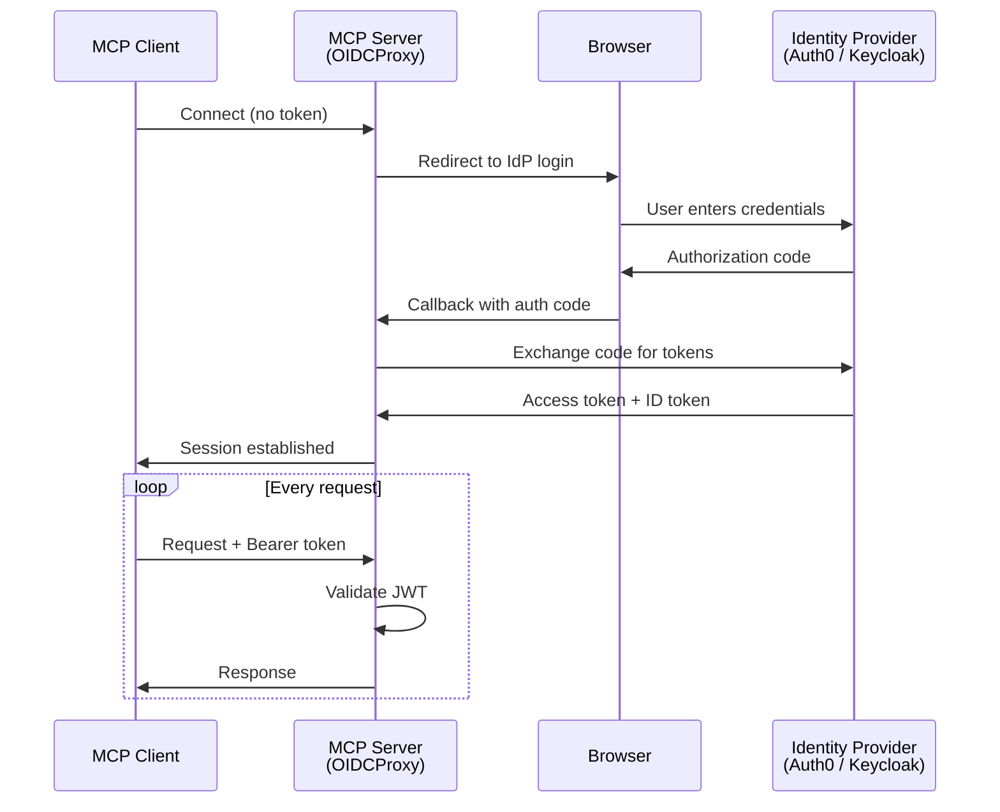
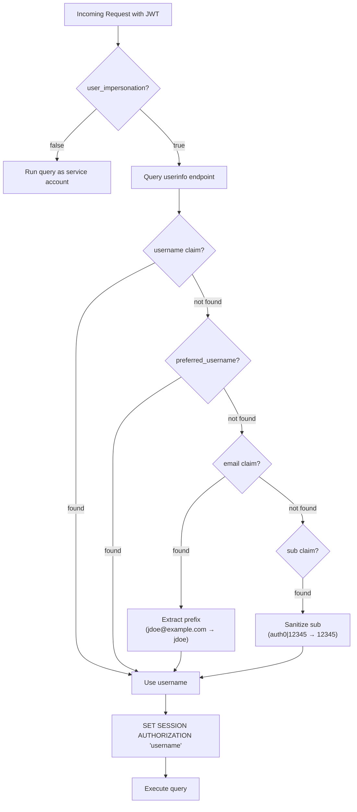

# Authentication (OAuth 2.0 / OIDC)

The Actian MCP Server supports **OAuth 2.0 / OpenID Connect (OIDC)** authentication. When enabled, every client request must carry a valid JWT (JSON Web Token) issued by a trusted identity provider (IdP).

!!! note "Transport requirement"
    OAuth is only available with network transports: `sse`, `http`, and `streamable-http`. The `stdio` transport (used for IDE integrations like Claude Desktop and Cursor) doesn't support OAuth.

## How OAuth works

The MCP server acts as an **OIDC Relying Party**. When a client connects for the first time, the server redirects the user's browser to the identity provider's login page. After successful authentication, the IdP issues a token that the client includes in every subsequent request.



## The `oauth` configuration block

Add an `oauth` object to your `conf.json` to enable authentication. The server reads these fields at startup:

| Field | Required | Description |
|-------|----------|-------------|
| `FASTMCP_SERVER_AUTH_CONFIG_URL` | Yes | OIDC discovery URL (for example, `https://domain/.well-known/openid-configuration`). Use HTTPS in production; `http://` is acceptable for local Keycloak development. |
| `FASTMCP_SERVER_AUTH_CLIENT_ID` | Yes | OAuth client ID from your identity provider. |
| `FASTMCP_SERVER_AUTH_CLIENT_SECRET` | Yes | OAuth client secret. |
| `FASTMCP_SERVER_AUTH_BASE_URL` | Yes | Public URL of the MCP server (for example, `http://127.0.0.1:8000`). Must be `https://` for non-localhost hosts. |
| `FASTMCP_SERVER_AUTH_AUDIENCE` | No | Token audience. Falls back to `CLIENT_ID` if omitted (standard for Keycloak). Auth0 requires an explicit audience. |
| `FASTMCP_SERVER_AUTH_SCOPE` | No | Space-separated scopes (for example, `read:mcp_server`). The scopes `openid`, `email`, and `profile` are always auto-appended. |
| `FASTMCP_SERVER_AUTH_REDIRECT_PATH` | No | Custom OAuth callback path. Defaults to `/auth/callback`. |
| `user_impersonation` | No | Boolean. When `true` (default), the server runs each query as the authenticated user through `SET SESSION AUTHORIZATION`. |

### Example

```json
{
    "oauth": {
        "FASTMCP_SERVER_AUTH_CONFIG_URL": "https://dev-abc123.us.auth0.com/.well-known/openid-configuration",
        "FASTMCP_SERVER_AUTH_CLIENT_ID": "wNXUdrp9aBcDeFgHiJkLmN",
        "FASTMCP_SERVER_AUTH_CLIENT_SECRET": "a1B2c3D4e5F6g7H8i9J0kLmNoPqRsTuVwXyZ",
        "FASTMCP_SERVER_AUTH_BASE_URL": "http://127.0.0.1:8000",
        "FASTMCP_SERVER_AUTH_AUDIENCE": "http://127.0.0.1:8000/mcp",
        "FASTMCP_SERVER_AUTH_SCOPE": "openid email profile read:mcp_server",
        "user_impersonation": true
    }
}
```

!!! warning "All-or-nothing configuration"
    Provide **all** required OAuth fields (`CONFIG_URL`, `CLIENT_ID`, `CLIENT_SECRET`, and `BASE_URL`) or **none**. If `CONFIG_URL` and `CLIENT_ID` are present but `CLIENT_SECRET` or `BASE_URL` is missing, the server fails to start with a `KeyError`. To disable OAuth, remove the entire `oauth` block.

!!! info "Scope auto-append"
    The scopes `openid`, `email`, and `profile` are always included automatically, even if you don't specify `FASTMCP_SERVER_AUTH_SCOPE`. You only need to add custom scopes (for example, `read:mcp_server`).

## User impersonation

When `user_impersonation` is `true` (the default), the server extracts a username from the authenticated user's JWT and runs `SET SESSION AUTHORIZATION "<username>"` before each database query. This ensures that each user operates under their own database permissions.

### Behavior

| `user_impersonation` | Behavior |
|----------------------|-----------|
| `true` (default) | JWT verified + `SET SESSION AUTHORIZATION "<user>"` per query. Every OAuth user needs a matching database account. |
| `false` | JWT still verified (unauthenticated requests are rejected), but all queries run under the service-account pool credentials. |

!!! warning "Zen doesn't support user impersonation"
    Actian Zen doesn't support `SET SESSION AUTHORIZATION`. If you're using the Zen plugin, set `user_impersonation` to `false` in the `oauth` block. The server still enforces JWT authentication—only the per-user database switching is skipped.

### Username extraction priority

The server extracts the database username from the token using the following priority order. It first queries the IdP's **userinfo endpoint**; if that fails, it falls back to the **token claims** directly.



!!! tip "Provider-specific behavior"
    - **Auth0**: Doesn't return `username` or `preferred_username` by default. In practice, the **email prefix** is used. Create database users matching the email prefix (for example, `jdoe@example.com` → database user `jdoe`).
    - **Keycloak**: Returns `preferred_username` by default when the `profile` scope is present. Create database users matching the Keycloak login name.
    - **Federated identity** (Google, SAML, and corporate SSO): The `sub` claim may be a provider-specific ID (for example, `google-oauth2|12345`) that doesn't match a database account. For SSO setups, set `user_impersonation` to `false` or ensure the IdP profile contains a `username` that matches the database account.

## HTTPS / TLS for remote deployments

OAuth 2.0 requires HTTPS for non-localhost hosts. When OAuth is configured and the server runs on a non-localhost address (for example, a VM or container), HTTPS is **mandatory**—the server refuses to start without `ssl_certfile` and `ssl_keyfile`.

### 1. Generate a certificate

For testing on a remote host, generate a self-signed certificate with a Subject Alternative Name (SAN):

```bash
openssl req -x509 -newkey rsa:4096 -keyout server.key -out server.crt \
  -days 365 -nodes \
  -subj "/CN=<your-ip-or-hostname>" \
  -addext "subjectAltName=IP:<your-ip>"
chmod 600 server.key
```

!!! warning "SAN is required"
    The `-addext "subjectAltName=IP:..."` flag is required. Node.js-based MCP clients (VS Code, Cursor) strictly enforce SAN validation and will reject certificates that only set the CN field.

!!! tip "Production certificates"
    For production, use a certificate issued by a trusted CA (Let's Encrypt, your corporate CA, etc.).

### 2. Configure TLS in conf.json

Add `ssl_certfile` and `ssl_keyfile` at the **top level** (not inside the `oauth` block) and update `BASE_URL` to `https://`:

```json
{
    "ssl_certfile": "/path/to/server.crt",
    "ssl_keyfile":  "/path/to/server.key",
    "oauth": {
        "FASTMCP_SERVER_AUTH_BASE_URL": "https://<your-ip-or-hostname>:8000"
    }
}
```

The server validates at startup that both paths exist and that `BASE_URL` uses `https://` when SSL is active.

### 3. Docker deployment

Mount the certificate and key into the container using volume flags:

```bash
docker run -p 8000:8000 \
  -v /path/to/server.crt:/app/server.crt:ro \
  -v /path/to/server.key:/app/server.key:ro \
  -v /path/to/conf.json:/app/conf.json:ro \
  actian/mcp-server:latest
```

Reference the container paths in `conf.json`:

```json
{
    "ssl_certfile": "/app/server.crt",
    "ssl_keyfile":  "/app/server.key"
}
```

!!! note "Docker key permissions"
    If mounting the key as a volume, the container user must be able to read it:

    - **Dev only**: `chmod 644 server.key` (world-readable — acceptable for local testing only)
    - **Production**: `sudo chown <container-uid>:<container-gid> server.key` to match the container user's UID/GID, keeping `chmod 600`
    - **Best practice**: Terminate TLS at a reverse proxy (nginx, Traefik) — the private key stays outside the container entirely

### 4. Trust the certificate in your MCP client

Self-signed certificates are rejected by Node.js-based MCP clients (VS Code and Cursor) by default. Copy the certificate to your development machine first:

```bash
scp user@<your-vm>:/path/to/server.crt ~/server.crt
```

=== "macOS"

    ```bash
    # Add to system keychain
    sudo security add-trusted-cert -d -r trustRoot \
      -k /Library/Keychains/System.keychain ~/server.crt

    # Ensure VS Code's Node.js runtime picks it up
    launchctl setenv NODE_EXTRA_CA_CERTS "$HOME/server.crt"

    # Fully restart VS Code (Cmd+Q, then reopen)
    ```

    !!! tip "Persist across reboots"
        Add `export NODE_EXTRA_CA_CERTS="$HOME/server.crt"` to `~/.zprofile`.

    !!! tip "Remove the certificate"
        Run `sudo security delete-certificate -c "<CN>" /Library/Keychains/System.keychain`

=== "Linux"

    ```bash
    sudo cp ~/server.crt /usr/local/share/ca-certificates/mcp-server.crt
    sudo update-ca-certificates

    # For VS Code / Node.js:
    export NODE_EXTRA_CA_CERTS="$HOME/server.crt"
    # Add to ~/.bashrc or ~/.profile to persist across sessions
    ```

=== "Windows"

    ```powershell
    # Import into Trusted Root store (run PowerShell as Administrator)
    Import-Certificate -FilePath "$env:USERPROFILE\server.crt" `
      -CertStoreLocation Cert:\LocalMachine\Root

    # For VS Code / Node.js:
    [System.Environment]::SetEnvironmentVariable(
      "NODE_EXTRA_CA_CERTS",
      "$env:USERPROFILE\server.crt",
      "User"
    )

    # Fully restart VS Code after setting the variable
    ```

## Security best practices

!!! danger "Protect your secrets"
    The `conf.json` file contains `CLIENT_SECRET` in plaintext. Follow these practices:

    - **Restrict file permissions**: `chmod 600 conf.json`
    - **Never commit to version control**: Add `conf.json` to `.gitignore`.
    - **Use HTTPS for `BASE_URL` in production**: Tokens sent over plain HTTP can be intercepted. The `http://127.0.0.1` examples are for local development only.
    - **Production secrets management**: Consider injecting secrets through environment variables or a secrets manager.

## Provider setup guides

Choose your identity provider for step-by-step setup instructions:

<div class="grid cards" markdown>

-   **Auth0**

    ---

    Cloud-hosted identity provider. Ideal for teams that want a managed service with no infrastructure to maintain.

    [:octicons-arrow-right-24: Auth0 setup guide](auth0/index.md)

-   **Keycloak**

    ---

    Open-source, self-hosted identity provider. Ideal for teams that need full control over their authentication infrastructure.

    [:octicons-arrow-right-24: Keycloak setup guide](keycloak/index.md)

</div>
