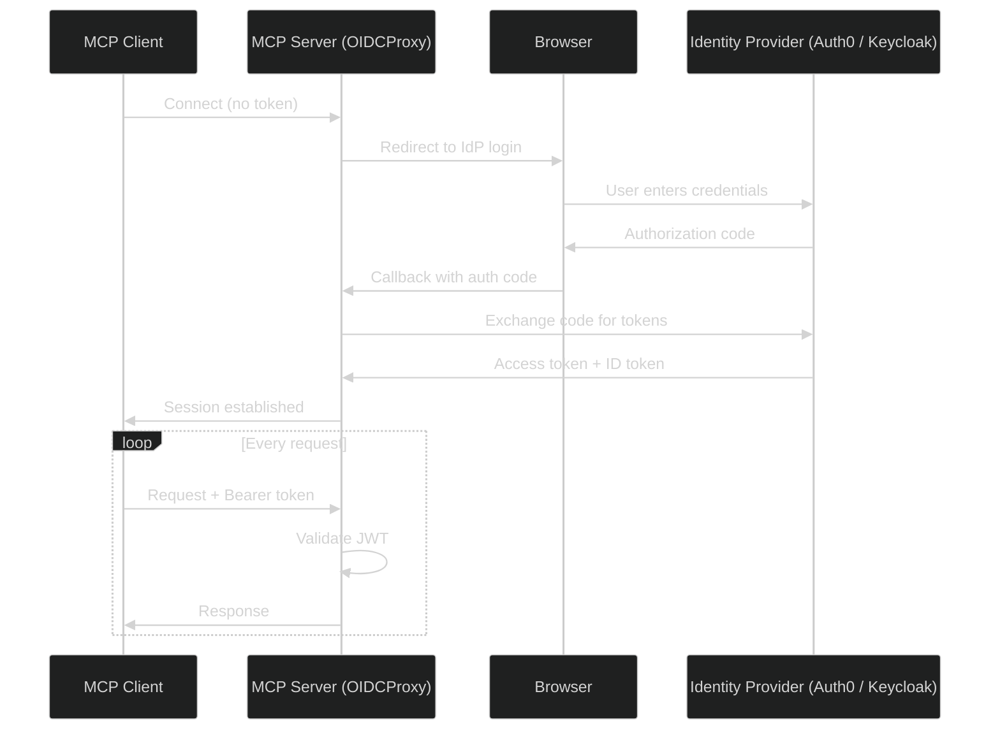
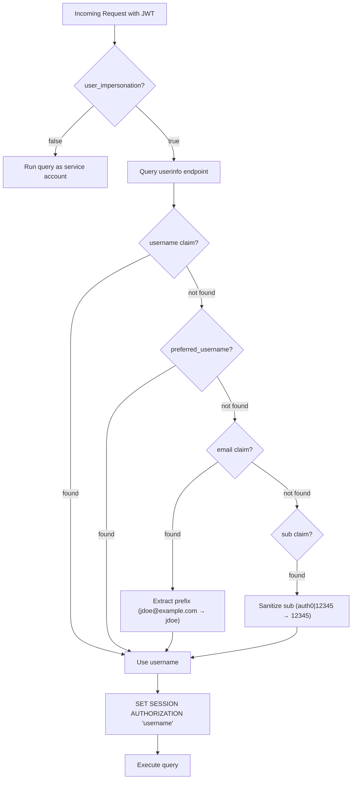

# Configuring OAuth 2.0 and OIDC Authentication

The Actian MCP Server supports OAuth 2.0 and OpenID Connect (OIDC) authentication. When you enable this feature, every client request must include a valid JSON Web Token (JWT) issued by a trusted identity provider (IdP).


!!! note "Important Deployment Considerations"
    - **Actian NoSQL users:**  NoSQL uses a direct OAuth 2.0 flow with different configuration properties. See [NoSQL Authentication guide](../nosql/authentication/index.md) for more information.
    - **Transport requirements:** OAuth only works with network transport such as `sse`, `http`, and `streamable-http`. You cannot use OAuth with the stdio transport, which is used for local IDE integrations like Claude Desktop or Cursor.


## Working with OAuth

The Actian MCP Server acts as an `OIDC Relying Party` by redirecting unauthenticated AI clients to the identity provider for secure login and token issuance. Once authenticated, the client includes this bearer token in all subsequent requests, allowing the server to validate the session and securely fulfill database queries.



## Configuring `oauth` Block

To enable authentication, add an `oauth` object to the `conf.json` file. The server reads these fields during startup.

| Field | Required | Description |
| :---- | :------- | :---------- |
| `FASTMCP_SERVER_AUTH_CONFIG_URL` | Yes | OIDC discovery URL, for example: `https://domain/.well-known/openid-configuration`. Use `https://` in production. `http://` is acceptable only for local Keycloak development. |
| `FASTMCP_SERVER_AUTH_CLIENT_ID` | Yes | OAuth client ID provided by the identity provider. |
| `FASTMCP_SERVER_AUTH_CLIENT_SECRET` | Yes | OAuth client secret. |
| `FASTMCP_SERVER_AUTH_BASE_URL` | Yes | External URL of the MCP server, for example: `https://<mcp-server-host>:8000`. It must use `https://`. |
| `FASTMCP_SERVER_AUTH_AUDIENCE` | No | Token audience. If omitted, it defaults to the `CLIENT_ID` (standard for Keycloak). **Note:** Auth0 requires an explicit audience. |
| `user_impersonation` | No | Boolean. If `true` (the default setting), the server runs each query as the authenticated user using `SET SESSION AUTHORIZATION`. |

### Example

```json
{
  "oauth": {
    "FASTMCP_SERVER_AUTH_CONFIG_URL": "https://dev-abc123.us.auth0.com/.well-known/openid-configuration",
    "FASTMCP_SERVER_AUTH_CLIENT_ID": "wNXUdrp9aBcDeFgHiJkLmN",
    "FASTMCP_SERVER_AUTH_CLIENT_SECRET": "a1B2c3D4e5F6g7H8i9J0kLmNoPqRsTuVwXyZ",
    "FASTMCP_SERVER_AUTH_BASE_URL": "https://<mcp-server-host>:8000",
    "FASTMCP_SERVER_AUTH_AUDIENCE": "<your-audience>",
    "user_impersonation": true
  }
}
```

!!! note "Important Configuration Considerations"
    You must either provide all four required OAuth fields (`CONFIG_URL`, `CLIENT_ID`, `CLIENT_SECRET`, and `BASE_URL`) or none. If you include `CONFIG_URL` and `CLIENT_ID`, and omit `CLIENT_SECRET` or `BASE_URL`, the server fails to start and throws a `KeyError`. To disable OAuth, remove the entire `oauth` block.

!!! info "Scopes"
    You do not need to configure specific scopes. The server automatically requests the `openid`, `email`, and `profile` scopes.


## User Impersonation

By default, the `user_impersonation` field is set to `true`. The server extracts a username from the authenticated user's JWT and runs `SET SESSION AUTHORIZATION "<username>"` before executing a database query. This ensures users only interact with data their specific database account is permitted to see.

|  user_impersonation | Server |
| :------------------- | :------- |
| `true` (default) | Verify the `JWT` and run `SET SESSION AUTHORIZATION "<user>"` for each query. Every OAuth user needs a matching database account. |
| `false` | Verify the `JWT` and reject unauthenticated requests. However, all approved queries will run under the shared service-account connection pool credentials.|

!!! note "Plugin Limitations"
    Not all connectors support user impersonation:
    - **Zen**: Does not support `SET SESSION AUTHORIZATION`. Set `user_impersonation` to `false` in the `oauth` block. JWT authentication works and only per-user database switching is skipped.
    - **NoSQL**: Uses a direct OAuth 2.0 flow, different authentication model. The `user_impersonation` field does not apply. For more information, see [NoSQL Authentication Guide](../nosql/authentication/index.md).

### Extracting Username

When user impersonation is active, the server extracts the database username from the token using the following priority order:



!!! tip "Provider-Specific Behavior"
    - **Auth0**: Does not return `username` or `preferred_username` by default. The server usually falls back to the email prefix. Ensure that the database usernames match the email prefixes, for example, create database user `jdoe` for `jdoe@example.com`.
    - **Keycloak**: Returns `preferred_username` by default when the `profile` scope is present. Create database users that match the Keycloak login names.
    - **Federated SSO (Google, SAML)**: The `sub` claim often generates a provider-specific ID (like `google-oauth2|12345`) that won't match a database account. For SSO setups, ensure the IdP profile passes a valid database `username`, or set `user_impersonation` to `false`.  

## Secure Remote Deployments with HTTPS and TLS

OAuth 2.0 requires HTTPS. If you configure OAuth, the server mandates HTTPS and refuses to start unless you provide the `ssl_certfile` and `ssl_keyfil`e paths.

### Step 1: Generate a certificate

For remote testing, generate a self-signed certificate with a Subject Alternative Name (SAN). 

```bash
openssl req -x509 -newkey rsa:4096 -keyout server.key -out server.crt \
  -days 365 -nodes \
  -subj "/CN=<your-ip-or-hostname>" \
  -addext "subjectAltName=IP:<your-ip>"
chmod 600 server.key
```

!!! warning "SAN is required"
    The `-addext "subjectAltName=IP:..."` flag is required. Node.js-based MCP clients (like VS Code and Cursor) strictly enforce SAN validation and rejects certificates that only use the Common Name (CN) field.

!!! tip "Production certificates"
    For production environments, use a certificate issued by a trusted Certificate Authority (CA), such as `Let's Encrypt or your corporate CA`.

### Step 2: Configure TLS in `conf.json`

!!! warning "NoSQL uses a different TLS configuration"
    The Actian NoSQL MCP Server do not use `conf.json` or `ssl_certfile`/`ssl_keyfile` fields. TLS is configured via Quarkus environment variables. See [NoSQL TLS guide](../nosql/authentication/index.md#tls) for more information.

Add the certificate `ssl_certfile` and key paths `ssl_keyfile` to the top level of the `conf.json` file (outside the `oauth` block), ensure the `BASE_URL` uses `https://`:

```json
{
  "ssl_certfile": "/app/server.crt",
  "ssl_keyfile": "/app/server.key",
  "oauth": {
    "FASTMCP_SERVER_AUTH_BASE_URL": "https://<your-ip-or-hostname>:8000"
  }
}
```

The server validates at startup that both paths exist and that `BASE_URL` uses `https://` when SSL is active.

### Step 3: Docker Deployment

Mount the certificate and key into the container using volume flags:

```bash
docker run -p 8000:8000 \
  -v /path/to/server.crt:/app/server.crt:ro \
  -v /path/to/server.key:/app/server.key:ro \
  -v /path/to/conf.json:/app/conf.json:ro \
  actian/mcp-server:latest
```

Reference the container paths in `conf.json`:
```json
{
  "ssl_certfile": "/app/server.crt",
  "ssl_keyfile": "/app/server.key"
}
```

!!! note "Docker key permissions"
    If mounting the key as a volume, the container user must be able to read it:

    - **Dev only**: `chmod 644 server.key` (world-readable; acceptable for local testing only)
    - **Production**: `sudo chown <container-uid>:<container-gid> server.key` to match the container user's UID/GID, keeping `chmod 600`
    - **Best practice**: Terminate TLS at a reverse proxy (nginx, Traefik) to keep the private key outside the container entirely

### Step 4: Trust the certificate in the MCP Client

By default, Node.js-based MCP clients (VS Code and Cursor) reject self-signed certificates. You must explicitly trust the certificate on your development machine.

First, securely copy the certificate to your machine:

```bash
scp user@<your-vm>:/path/to/server.crt ~/server.crt
```

Next, configure the operating system to trust it:

=== "macOS"

    ```bash
    # Add to system keychain
    sudo security add-trusted-cert -d -r trustRoot \
      -k /Library/Keychains/System.keychain ~/server.crt

    # Ensure VS Code's Node.js runtime picks it up
    launchctl setenv NODE_EXTRA_CA_CERTS "$HOME/server.crt"

    # Fully restart VS Code (Cmd+Q, then reopen)
    ```

    !!! tip "Persist across reboots"
        Add `export NODE_EXTRA_CA_CERTS="$HOME/server.crt"` to `~/.zprofile`.

    !!! tip "Remove the certificate"
        Run `sudo security delete-certificate -c "<CN>" /Library/Keychains/System.keychain`

=== "Linux"

    ```bash
    sudo cp ~/server.crt /usr/local/share/ca-certificates/mcp-server.crt
    sudo update-ca-certificates

    # For VS Code / Node.js:
    export NODE_EXTRA_CA_CERTS="$HOME/server.crt"
    # Add to ~/.bashrc or ~/.profile to persist across sessions
    ```

=== "Windows"

    ```powershell
    # Import into Trusted Root store (run PowerShell as Administrator)
    Import-Certificate -FilePath "$env:USERPROFILE\server.crt" `
      -CertStoreLocation Cert:\LocalMachine\Root

    # For VS Code / Node.js:
    [System.Environment]::SetEnvironmentVariable(
      "NODE_EXTRA_CA_CERTS",
      "$env:USERPROFILE\server.crt",
      "User"
    )

    # Fully restart VS Code after setting the variable
    ```

## Security Best Practices

!!! danger "Protect your secrets"
    The `conf.json` file contains `CLIENT_SECRET` in plaintext. Follow the following security guidelines:
    
    - Lock down file permissions: Run chmod 600 conf.json` to restrict access on the host machine.
    - Keep secrets out of version control: Add c`onf.json` to your `.gitignore` file immediately.
    - Mandate HTTPS: Always use `https://` for the `BASE_URL`. Tokens sent over plain HTTP are vulnerable to interception.
    - Use production secrets management: For production environments, avoid plaintext files entirely. Inject your secrets   dynamically using environment variables or a dedicated secrets manager.

## Provider Setup Guides

Choose your identity provider for step-by-step setup instructions:

<div class="grid cards" markdown>

- :material-cloud: **[Auth0](auth0/index.md)**  
  Cloud-hosted identity provider. Ideal for teams that want a managed service with no infrastructure to maintain.

- :material-key: **[Keycloak](keycloak/index.md)**  
  Open-source, self-hosted identity provider. Ideal for teams that need full control over their authentication infrastructure.

</div>
