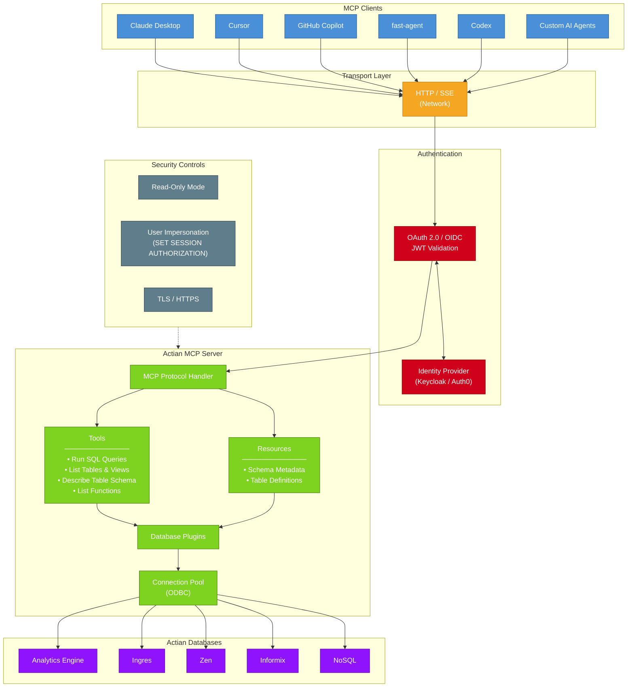
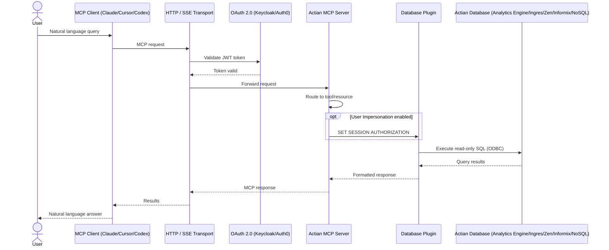

<!-- Hero Section -->

  <blockquote class="hero-quote">
    Connect AI agents to your Actian databases with the Model Context Protocol.
  </blockquote>

  

    <a href="./get_started/index.html" class="primary-link">Get started →</a>
  

<!-- MCP Workflow Diagrams -->

## Architecture Overview

## End-to-End Request Flow

<!-- Value Propositions -->

  

    

      <h3 class="jumbo-heading">Connect</h3>
      
Bridge any MCP-compatible AI client directly to Ingres, Analytics Engine, Informix, NoSQL, and Zen.

    

    

      <h3 class="jumbo-heading">Extend</h3>
      
Build custom tools, resources, and prompts using the plugin architecture. Add new Actian data sources in minutes.

    

    

      <h3 class="jumbo-heading">Trust</h3>
      
Secure every connection with OAuth 2.0, read-only mode, and multi-tenant isolation built into the core.

    

  

<!-- Supported Databases Section -->

  

    <h3 class="jumbo-heading">One server, every Actian database</h3>
    

      The Actian MCP Server provides a unified MCP interface across the full Actian database portfolio. Each database has its own tools, resources, and prompts tailored to its capabilities.
    

  

  

    <a class="database-card" href="./analytics_engine/index.html">
      <h4 class="database-name">Analytics Engine</h4>
      
Column-store analytics database optimized for complex queries, large-scale aggregations, and data warehousing workloads.

    </a>

    <a class="database-card" href="./ingres/index.html">
      <h4 class="database-name">Ingres</h4>
      
Enterprise relational database with full ACID compliance, robust SQL support, and proven scalability for mission-critical applications.

    </a>

    <a class="database-card" href="./informix/index.html">
      <h4 class="database-name">Informix&reg;</h4>
      
High-performance relational database designed for OLTP workloads, time-series data, and IoT applications.

    </a>

    <a class="database-card" href="./nosql/index.html">
      <h4 class="database-name">NoSQL</h4>
      
Flexible document and key-value store for schema-free data models, JSON documents, and rapid application development.

    </a>

    <a class="database-card" href="./zen/index.html">
      <h4 class="database-name">Zen</h4>
      
Edge-to-cloud embedded database with zero-administration deployment, local and remote data access, and minimal resource requirements.

    </a>
  

<!-- Get Started Section -->

  

    

      <h2 class="jumbo-heading">Up and running in minutes</h2>
      

        Pull the container image, drop in a config file, and your AI agent can query Actian databases, explore schemas, and run analytics — all through natural language.
      

      

        <a href="./get_started/index.html" class="primary-link">Read the quickstart →</a>
      

    

    

      

        <pre><code>docker run -d \
  -v $(pwd)/conf.json:/app/conf.json:ro \
  -p 8000:8000 \
  actian/analytics-engine-mcp-server</code></pre>
      

    

  

<!-- Features Section -->

  

    <h3 class="jumbo-heading">Everything you need to build with MCP</h3>
    

      From schema introspection to query execution to custom plugins, the Actian MCP Server gives AI agents full, governed access to your data.
    

  

  

    

      <h4 class="feature-title">Tools & resources</h4>
      
Expose SQL execution, schema discovery, and data operations as MCP-native tools and resources.

      <a href="./analytics_engine/tools/index.html" class="primary-link">Explore tools →</a>
    

    

      <h4 class="feature-title">Authentication & security</h4>
      
OAuth 2.0 with Keycloak or Auth0, TLS encryption, read-only mode, and user impersonation out of the box.

      <a href="./authentication/index.html" class="primary-link">Set up authentication →</a>
    

    

      <h4 class="feature-title">Flexible deployment</h4>
      
Deploy as a Docker container with HTTP/SSE transport for local or remote MCP clients.

      <a href="./get_started/index.html" class="primary-link">Deploy the server →</a>
    

  

