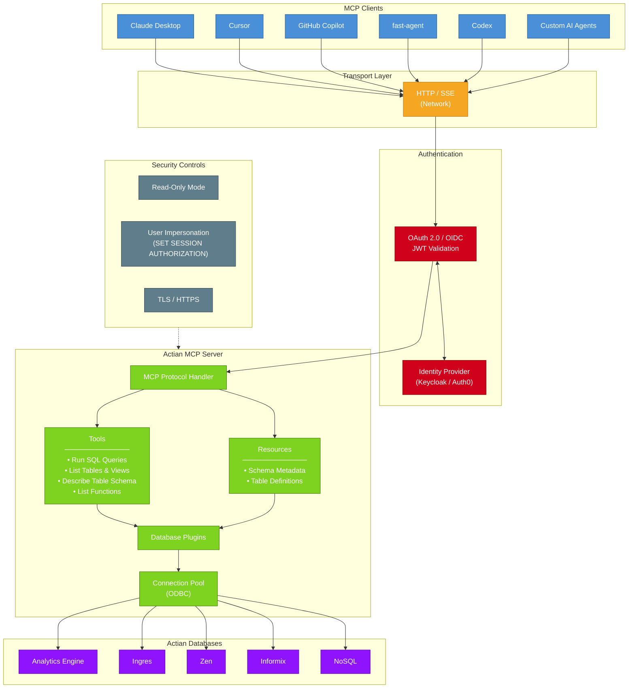
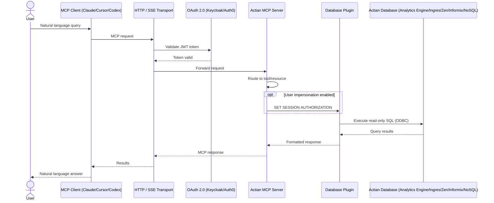

# Introduction to Actian MCP Server

The **Actian MCP Server** is a configurable server that implements the [Model Context Protocol (MCP)](https://modelcontextprotocol.io/) so AI applications can work with Actian data in a consistent and controlled way.

At a high level, it acts as a bridge between an MCP-compatible client and an Actian data source. It helps AI agents discover available capabilities, access metadata, and perform database tasks through a standard protocol rather than custom integrations.

## What is MCP?

The **Model Context Protocol (MCP)** is an open standard for connecting AI models to external systems, such as tools, data sources, and services. An MCP server exposes a small set of building blocks that AI clients can use:

| Primitive | Description |
|-----------|-------------|
| **Tools** | Callable functions the AI can invoke (for example, run a SQL query) |
| **Resources** | Read-only data sources the AI can access (for example, schema information) |
| **Prompts** | Pre-built prompt templates for common workflows |

## What does the Actian MCP Server do?

The Actian MCP Server provides a common MCP layer for **Actian DBMS platforms**. Instead of building separate integrations for each client or workflow, you can expose database capabilities through one server interface.

Depending on how it's configured, the server can help AI clients:

- Run database queries through MCP tools
- Discover tables and other database objects
- Inspect schema details and metadata
- Use reusable prompts for database-oriented tasks

The server handles the surrounding concerns, such as transport, configuration, authentication, and secure access to the target database.

<!-- MCP Workflow Diagrams -->

## Architecture overview

## End-to-end request flow

## Key features

- **MCP-native capabilities** — Exposes tools, resources, and prompts in a standard format.
- **Container-friendly deployment** — Runs a server instance for a specific Actian DBMS in its own container.
- **OAuth 2.0 support** — Provides secure authentication for MCP clients.
- **Transport** — Runs in `http` transport mode.
- **Read-only mode** — Restricts AI agents to read-only database operations.
- **Schema discovery** — Lets AI agents inspect database structure and metadata.

## How it works

Each Actian DBMS is served by its own Actian MCP Server instance.

- A server instance starts with the user-selected configuration.
- The server connects to one target Actian DBMS.
- The server exposes database tools, resources, and prompts through MCP.
- An AI client uses those MCP capabilities to query data and inspect metadata.

This keeps the user experience simple: each server instance represents one Actian database environment that an MCP client can connect to directly.

## Why it matters

The Actian MCP Server makes it easier to connect AI-driven workflows to Actian environments without designing a separate integration for each use case. It gives teams a standard way to expose trusted database capabilities to MCP clients while keeping deployment and control in the server layer.

## Next steps

- [Get Started](../get_started/index.md) — Deploy and connect your first MCP server
