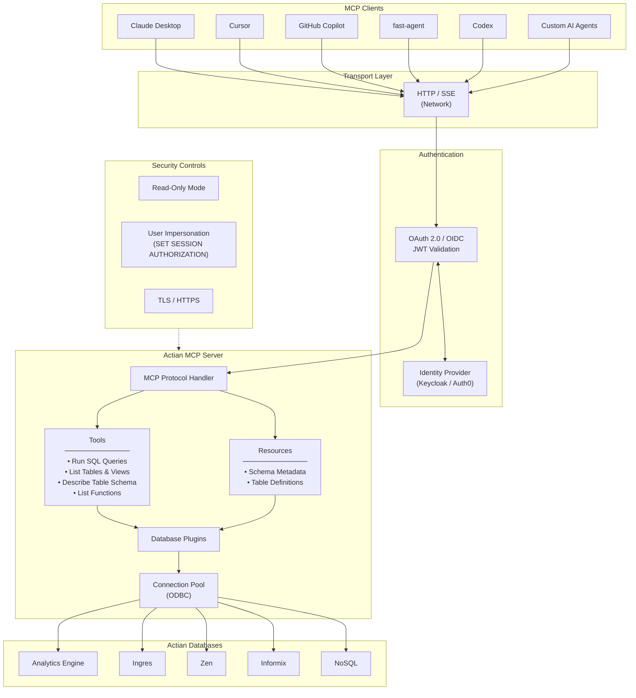
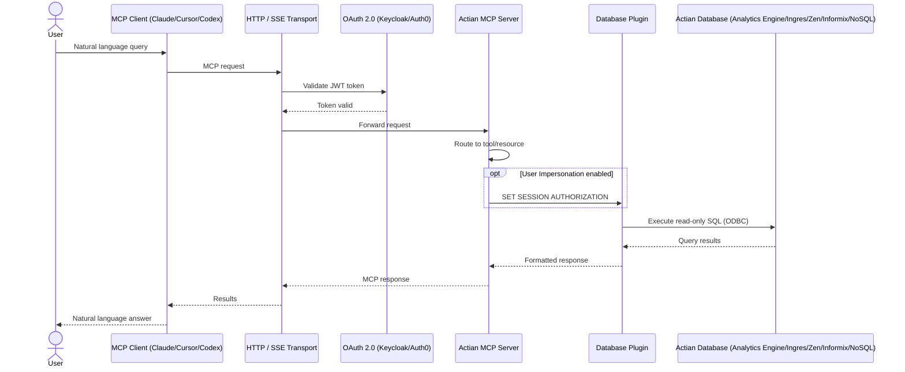

# Introduction to Actian MCP Server

The **Actian MCP Server** is a configurable server that implements the [Model Context Protocol (MCP)](https://modelcontextprotocol.io/) so AI applications can work with Actian data in a consistent and controlled way.

At a high level, it acts as a bridge between an MCP-compatible client and an Actian data source. It helps AI agents discover available capabilities, access metadata, and perform database tasks through a standard protocol rather than custom integrations.

## What is MCP?

The **Model Context Protocol (MCP)** is an open standard for connecting AI models to external systems, such as tools, data sources, and services. An MCP server exposes a small set of building blocks that AI clients can use:

| Primitive | Description |
| :-------- | :---------- |
| **Tools** | Callable functions the AI can invoke — for example, run a SQL query |
| **Resources** | Read-only data sources the AI can access — for example, schema information |
| **Prompts** | Pre-built prompt templates for common workflows |

## What does the Actian MCP Server do?

The Actian MCP Server provides a common MCP layer for **Actian DBMS platforms**. Instead of building separate integrations for each client or workflow, you can expose database capabilities through one server interface.

Depending on configuration, the server enables AI clients to:

- Run database queries through MCP tools
- Discover tables and other database objects
- Inspect schema details and metadata
- Use reusable prompts for database-oriented tasks

The server handles surrounding concerns such as transport, configuration, authentication, and secure access to the target database.

## Architecture overview

## End-to-end request flow

## Key features

-   :material-connection:{ style="color: #1E88E5" } **MCP-native capabilities**

    ---

    Exposes tools, resources, and prompts in a standard MCP format usable by any compatible client.

-   :material-docker:{ style="color: #1E88E5" } **Container-friendly deployment**

    ---

    Runs a server instance for a specific Actian DBMS in its own container for clean isolation.

-   :material-shield-lock:{ style="color: #1E88E5" } **OAuth 2.0 support**

    ---

    Provides secure, standards-based authentication for all MCP clients.

-   :material-transit-connection-horizontal:{ style="color: #1E88E5" } **HTTP transport**

    ---

    Runs in `http` transport mode for straightforward network connectivity.

-   :material-eye-lock:{ style="color: #1E88E5" } **Read-only mode**

    ---

    Restricts AI agents to read-only database operations to prevent unintended data changes.

-   :material-database-search:{ style="color: #1E88E5" } **Schema discovery**

    ---

    Lets AI agents inspect database structure and metadata before querying.

## How it works

Each Actian DBMS is served by its own Actian MCP Server instance.

<h4 class="step-title">Start with configuration</h4>

A server instance starts with your selected configuration targeting one Actian DBMS.

<h4 class="step-title">Connect to the database</h4>

The server establishes a connection to the target Actian DBMS via an ODBC connection pool.

<h4 class="step-title">Expose MCP capabilities</h4>

The server surfaces database tools, resources, and prompts through the MCP protocol.

<h4 class="step-title">AI client connects</h4>

An MCP-compatible client uses those capabilities to query data, inspect metadata, and run workflows.

!!! info 
    Each server instance represents one Actian database environment. This keeps setup simple — one server, one database, one MCP endpoint.

## Why it matters

The Actian MCP Server removes the need to build separate integrations for each AI use case. It gives teams a standard way to expose trusted database capabilities to MCP clients while keeping deployment and access control in the server layer.

## Next steps

-   :material-rocket-launch:{ style="color: #1E88E5" } **Get Started**

    ---

    Follow our quickstart guide to deploy your first Actian MCP Server instance and connect it to an AI client.

    [Get Started →](../get_started/index.md)

