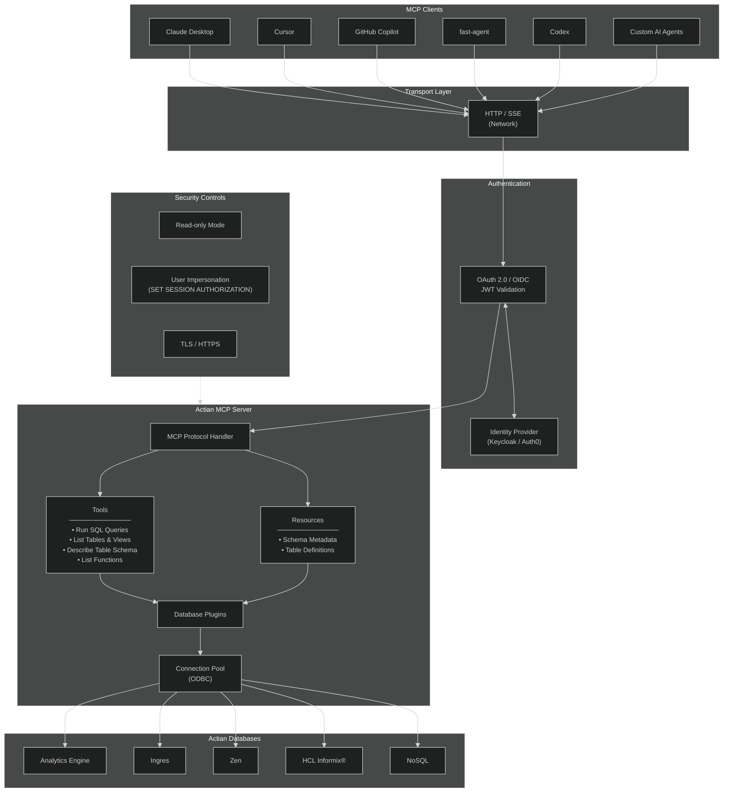
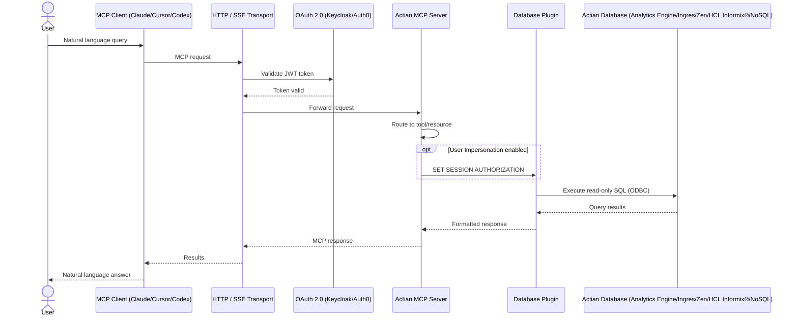

# Actian MCP Server

The Actian [Model Context Protocol (MCP)](https://modelcontextprotocol.io/) Server connects artificial intelligence (AI) applications to the Actian databases. By implementing the open-source MCP, the server acts as a secure bridge between an MCP-compatible AI client and the data source. It eliminates the need for custom integrations, allowing AI agents to discover capabilities, access metadata, and safely run database tasks through a standardized connection.

MCP is an open standard designed to connect AI models with external systems, tools, and data sources. When you use an Actian MCP Server, it provides the AI clients with three core building blocks:

| Component | Description | Example | 
|-----------|-------------|---------|
| **Tools** | Callable functions that the AI can invoke| Running a specific SQL query |
| **Resources** | Read-only data sources that the AI can access| Viewing database schema information |
| **Prompts** |Prebuilt templates designed for recurring tasks| Reusing common database workflows |

## MCP Server Capabilities 

You can use the Actian MCP Server to provide a single and unified interface for the Actian database management systems instead of building and maintaining separate connections for every AI client or workflow.

Depending on the configuration, the server enables AI clients to:

- Run database queries using MCP tools.
- Discover tables and other database objects.
- Review schema details and metadata.
- Use reusable prompts for database-oriented tasks.

The server also manages backend requirements, including transport, configuration, authentication, and secure database access.

## Architecture and Request Flow

### Workflow

The Actian MCP Server sits between AI clients and the databases that they need to access.

### End-to-End Request Flow

When an AI agent interacts with the database, the system follows the standard sequence:

## Key Features

- :material-connection: **MCP-Native Capabilities**  
  Exposes tools, resources, and prompts in a standard MCP format usable by any compatible client.

- :material-docker: **Container-Friendly Deployment**  
  Runs each DBMS server instance in its own container to ensure clean environment isolation.

- :material-shield-lock: **OAuth 2.0 Support**  
  Uses `OAuth 2.0` to provide secure, standards-based access for all MCP clients.

- :material-transit-connection-horizontal: **HTTP Transport**  
  Operates in `HTTP` transport mode to simplify network connectivity.

- :material-eye-lock: **Read-only Mode**  
  Restricts AI agents to read-only operations, preventing unintended modifications to the data.

- :material-database-search: **Schema Discovery**  
  Enables AI agents to review database structures and metadata before executing queries.

## MCP Server Deployment

You can deploy an MCP Server as follows:

<h4 class="step-title">Configure the server</h4>

Start a server instance using a configuration that targets the specific Actian DBMS.

<h4 class="step-title">Connect to the database</h4>

The server connects to the target DBMS using an ODBC connection pool.

<h4 class="step-title">Use database capabilities</h4>

The server makes database tools, resources, and prompts available through the MCP protocol.

<h4 class="step-title">Connect to the AI client</h4>

An MCP-compatible client uses the database capabilities to query data, inspect metadata, and run workflows.

!!! info 
    Each Actian DBMS requires its own dedicated Actian MCP Server instance, which means there is a single server, database, and MCP endpoint.

## MCP Server Advantages 

By removing the need to build individual integrations for every AI use case, the Actian MCP Server provides a standardized way to use the trusted database capabilities. It ensures that deployment and access control remain securely managed at the server layer.

## Next Steps

- :material-rocket-launch: **[Get Started](../get-started/index.md)**  
  To deploy Actian MCP Server instance and connect it to an AI client, see [Getting Started with MCP Server](../get-started/index.md).

