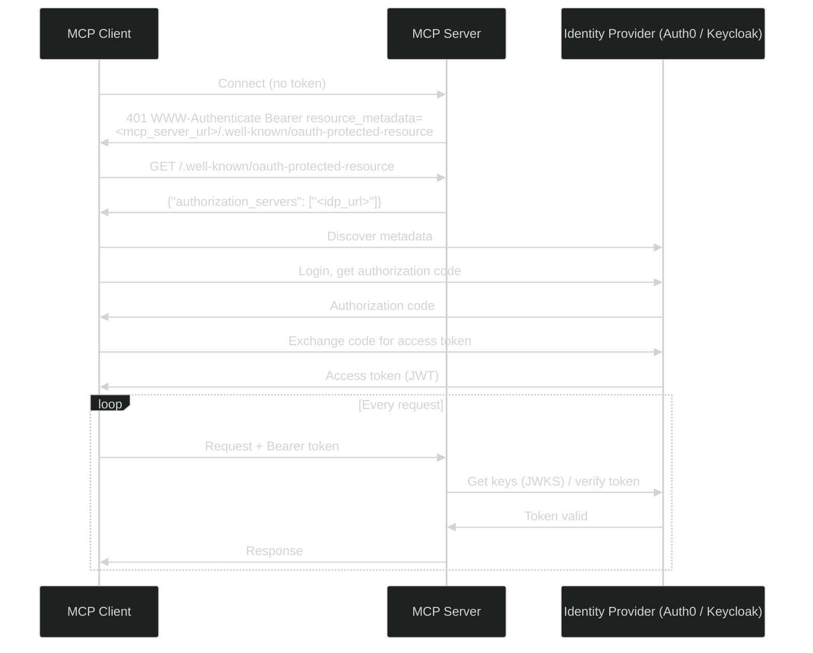

# Authentication

The Actian MCP Server for Actian NoSQL supports OAuth 2.0 and OpenID Connect (OIDC) authentication. When you enable this feature, every client request must include a valid JSON Web Token (JWT) issued by a trusted identity provider (IdP).

!!! info "Database credentials vs. OAuth:"
    There are two types of authentication:

     - **Database credentials:** The `user:password` portion of the NoSQL connection URL (for example, `cars@localhost#admin:secret`) is always used to authenticate with the database itself when the server starts.
     - **OAuth 2.0:** This controls access to the MCP Server endpoint.

## Working with OAuth

Authentication is **disabled by default**. When you enable it, all `/mcp/*` endpoints require a valid Bearer token issued by an OIDC provider.
The server acts as an OAuth 2.0 resource server. It exposes a resource metadata endpoint at `/.well-known/oauth-protected-resource`. MCP clients use this endpoint to discover the identity provider and initiate the appropriate OAuth flow.

Two flows are supported:

- **Authorization Code** — for interactive clients (Claude Desktop, Cursor, the FastMCP Python client). The client redirects the user to the identity provider for login and receives a token after consent.
- **Client Credentials** — for machine-to-machine (M2M) scenarios where no user interaction is possible. The client authenticates directly with the identity provider using its own credentials.

The diagram below illustrates the Authorization Code flow:



### Configuration

| Property | Required | Description |
|---|---|---|
| `mcp.auth.enabled` | Yes (to enable) | Set to `true` to enable OAuth2 authentication. Disabled by default. |
| `quarkus.oidc.auth-server-url` | Yes (when enabled) | Issuer URL of your OIDC provider — for example, `https://your-idp.example.com/`. |
| `quarkus.oidc.sse-tenant.auth-server-url` | No | Override the OIDC provider for the SSE endpoint (`/mcp/sse`) only. Defaults to `quarkus.oidc.auth-server-url`. |

!!! note "Quarkus OIDC configuration"
    The table lists the most common properties. The full set of options is provided by the [Quarkus OIDC configuration reference](https://quarkus.io/guides/security-openid-connect-client-reference#configuration-reference).


Two OIDC tenants are pre-configured:

| Tenant | Path | Property Prefix |
|---|---|---|
| Default | `/mcp/*` | `quarkus.oidc.*` |
| SSE | `/mcp/sse` | `quarkus.oidc.sse-tenant.*` |

Both tenants share the same auth server URL by default. Override the SSE tenant only if the SSE endpoint needs a different identity provider.

### Example

Add the following to your `application.properties` and start the server as described in [Start the Server](../index.md#start-the-server):

```properties
nsql.connectionURL=<connection-url>
mcp.auth.enabled=true
quarkus.oidc.auth-server-url=https://your-idp.example.com/
```


## Secure Remote Deployments with HTTPS and TLS

To secure the connection, provide a certificate and private key. The `.0.` in the property name is the index of the PEM key-store entry — increment it to add multiple certificates.

| Property | Required | Description |
|---|---|---|
| `quarkus.tls.key-store.pem.0.cert` | Yes (for TLS) | Path to the PEM certificate file inside the container. |
| `quarkus.tls.key-store.pem.0.key` | Yes (for TLS) | Path to the PEM private key file inside the container. |
| `quarkus.http.insecure-requests` | No | Controls how insecure HTTP requests are handled. Set it to `redirect` to send all HTTP traffic to HTTPS, or to `disabled` to reject insecure HTTP requests entirely. |

!!! note "Quarkus TLS configuration"
    The table lists the most common properties. The full set of options is provided by the [Quarkus TLS Registry](https://quarkus.io/guides/tls-registry-reference) extension.

### Example

!!! note "Generating and trusting a self-signed certificate"
    For instructions on generating a self-signed certificate and trusting it in the MCP client, see [Secure Remote Deployments with HTTPS and TLS](../../authentication/index.md#secure-remote-deployments-with-https-and-tls) in the main Authentication guide.

Add the following to your `application.properties`:

```properties
nsql.connectionURL=<connection-url>
quarkus.tls.key-store.pem.0.cert=/certs/server.crt
quarkus.tls.key-store.pem.0.key=/certs/server.key
quarkus.http.insecure-requests=redirect
```

Then mount both the properties file and the certificate directory, and expose the HTTPS port:

```bash
docker run \
  -v $(pwd)/application.properties:/home/jboss/config/application.properties:ro \
  -v $(pwd)/certs:/certs:ro \
  -p 8080:8080 \
  -p 8443:8443 \
  actian/nsql-mcp-server:1.0.0
```


## Provider Setup Guides

Choose your identity provider for step-by-step setup instructions:

<div class="grid cards" markdown>

- :material-cloud: **[Auth0](auth0/index.md)**  
  Cloud-hosted identity provider. Ideal for teams that want a managed service with no infrastructure to maintain.

- :material-key: **[Keycloak](keycloak/index.md)**  
  Open-source, self-hosted identity provider. Ideal for teams that need full control over their authentication infrastructure.

</div>