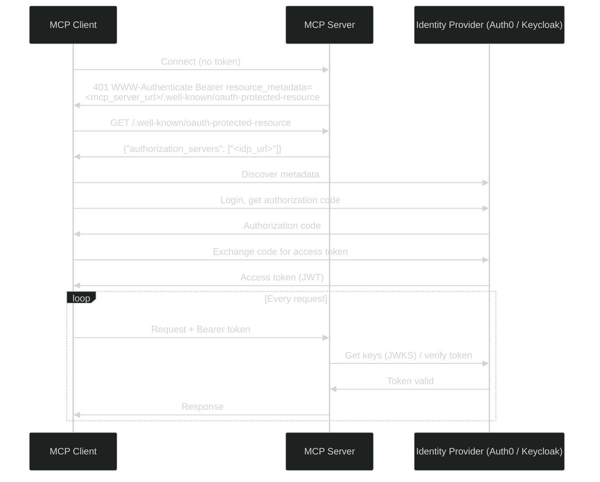

# Authentication

The Actian MCP Server for Actian NoSQL Database supports **OAuth 2.0** authentication and HTTPS. All settings are provided through `application.properties`.

!!! note "Database credentials vs. OAuth"
    The `user:password` portion of the NoSQL connection URL (for example, `cars@localhost#admin:secret`) authenticates against the **database** itself. This is separate from OAuth, which controls access to the **MCP Server** endpoint.

## OAuth 2.0

Authentication is **disabled by default**. When enabled, all `/mcp/*` endpoints require a valid Bearer token issued by an OIDC provider.

The server acts as an OAuth2 resource server and exposes a resource metadata endpoint at `/.well-known/oauth-protected-resource`. MCP clients use this to automatically discover the identity provider and complete the authorization code flow without any manual configuration.



### Configuration

!!! note "Quarkus OIDC configuration"
    The table below lists the most common properties. The full set of options is provided by the [Quarkus OIDC configuration reference](https://quarkus.io/guides/security-openid-connect-client-reference).

| Property | Required | Description |
|---|---|---|
| `mcp.auth.enabled` | Yes (to enable) | Set to `true` to enable OAuth2 authentication. Disabled by default. |
| `quarkus.oidc.auth-server-url` | Yes (when enabled) | Issuer URL of your OIDC provider — for example, `https://your-idp.example.com/realms/your-realm`. |
| `quarkus.oidc."sse-tenant".auth-server-url` | No | Override the OIDC provider for the SSE endpoint (`/mcp/sse`) only. Defaults to `quarkus.oidc.auth-server-url`. |

Two OIDC tenants are pre-configured:

| Tenant | Path | Property Prefix |
|---|---|---|
| Default | `/mcp/*` | `quarkus.oidc.*` |
| SSE | `/mcp/sse` | `quarkus.oidc."sse-tenant".*` |

Both tenants share the same auth server URL by default. Override the SSE tenant only if your SSE endpoint needs a different identity provider.

### Provider Setup

The identity provider configuration — creating a realm, registering an OAuth2 client, and managing users — is the same regardless of the database connector. Follow the existing provider guides for those steps:

<div class="grid cards" markdown>

- :material-cloud: **[Auth0](../../authentication/auth0/index.md)**  
  Set up an Auth0 application and configure the OAuth2 client.

- :material-key: **[Keycloak](../../authentication/keycloak/index.md)**  
  Set up a Keycloak realm and configure the OAuth2 client.

</div>

Once your identity provider is configured, use the issuer URL it provides as the value for `quarkus.oidc.auth-server-url` in your `application.properties`.

### Example

Add the following to your `application.properties` and start the server as described in [Start the Server](../index.md#start-the-server):

```properties
nsql_connectionURL=<connection-url>
mcp.auth.enabled=true
quarkus.oidc.auth-server-url=https://your-idp.example.com/realms/your-realm
```


## TLS

!!! note "Generating and trusting a self-signed certificate"
    For instructions on generating a self-signed certificate and trusting it in your MCP client, see [HTTPS / TLS for Remote Deployments](../../authentication/index.md#https-tls-for-remote-deployments) in the main Authentication guide.

!!! note "Quarkus TLS configuration"
    The table below lists the most common properties. The full set of options is provided by the [Quarkus TLS Registry](https://quarkus.io/guides/tls-registry-reference) extension.

To enable HTTPS, provide a certificate and private key. The `.0.` in the property name is the index of the PEM key-store entry — increment it to add multiple certificates.

| Property | Required | Description |
|---|---|---|
| `quarkus.tls.key-store.pem.0.cert` | Yes (for TLS) | Path to the PEM certificate file inside the container. |
| `quarkus.tls.key-store.pem.0.key` | Yes (for TLS) | Path to the PEM private key file inside the container. |
| `quarkus.http.insecure-requests` | No | Set to `redirect` to redirect all HTTP traffic to HTTPS. |

### Example

Add the following to your `application.properties`:

```properties
nsql_connectionURL=<connection-url>
quarkus.tls.key-store.pem.0.cert=/certs/server.crt
quarkus.tls.key-store.pem.0.key=/certs/server.key
```

Then mount both the properties file and the certificate directory, and expose the HTTPS port:

```bash
docker run --name NSQL-MCP \
  -v /path/to/application.properties:/home/jboss/config/application.properties:ro \
  -v /path/to/certs:/certs:ro \
  -p 8080:8080 \
  -p 8443:8443 \
  actian/nsql-mcp-server:1.0.0
```

