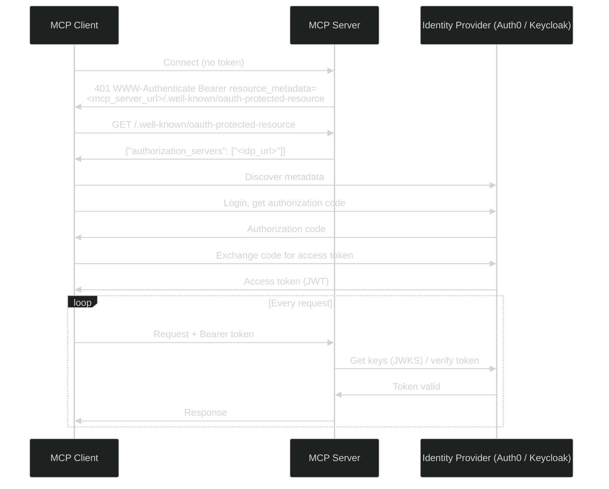

# Authentication

The Actian NoSQL MCP Server supports **OAuth 2.0** authentication and HTTPS. All settings are supplied as environment variables to the container.

!!! note "Database credentials vs. OAuth"
    The `user:password` portion of the NoSQL connection URL (for example, `cars@localhost#admin:secret`) authenticates against the **database** itself. This is separate from OAuth, which controls access to the **MCP Server** endpoint.

## OAuth 2.0

Authentication is **disabled by default**. When enabled, all `/mcp/*` endpoints require a valid Bearer token issued by an OIDC provider.

The server acts as an OAuth2 resource server and exposes a resource metadata endpoint at `/.well-known/oauth-protected-resource`. MCP clients use this to automatically discover the identity provider and complete the authorization code flow without any manual configuration.



### Configuration

!!! note "Quarkus OIDC configuration"
    The table below lists the most common properties. The full set of options is provided by the [Quarkus OIDC configuration reference](https://quarkus.io/guides/security-openid-connect-client-reference) — any property can be passed as an environment variable using `SCREAMING_SNAKE_CASE` notation.

| Environment Variable | Required | Description |
|---|---|---|
| `MCP_AUTH_ENABLED` | Yes (to enable) | Set to `true` to enable OAuth2 authentication. Disabled by default. |
| `QUARKUS_OIDC_AUTH_SERVER_URL` | Yes (when enabled) | Issuer URL of your OIDC provider — for example, `https://your-idp.example.com/realms/your-realm`. |
| `QUARKUS_OIDC_SSE_TENANT_AUTH_SERVER_URL` | No | Override the OIDC provider for the SSE endpoint (`/mcp/sse`) only. Defaults to `QUARKUS_OIDC_AUTH_SERVER_URL`. |

Two OIDC tenants are pre-configured:

| Tenant | Path | Environment Variable Prefix |
|---|---|---|
| Default | `/mcp/*` | `QUARKUS_OIDC_*` |
| SSE | `/mcp/sse` | `QUARKUS_OIDC_SSE_TENANT_*` |

Both tenants share the same auth server URL by default. Override the SSE tenant only if your SSE endpoint needs a different identity provider.

### Example

```bash
docker run --name NSQL-MCP \
  -e NSQL_CONNECTIONURL=<connection-url> \
  -e MCP_AUTH_ENABLED=true \
  -e QUARKUS_OIDC_AUTH_SERVER_URL=https://your-idp.example.com/realms/your-realm \
  -p 8080:8080 \
  actian/nsql-mcp-server:1.0.0
```

### Provider Setup

The identity provider configuration — creating a realm, registering an OAuth2 client, and managing users — is the same for the NoSQL MCP Server as for any other connector. Follow the existing provider guides for those steps:

<div class="grid cards" markdown>

- :material-cloud: **[Auth0](../../authentication/auth0/index.md)**  
  Set up an Auth0 application and configure the OAuth2 client.

- :material-key: **[Keycloak](../../authentication/keycloak/index.md)**  
  Set up a Keycloak realm and configure the OAuth2 client.

</div>

Once your identity provider is configured, use the issuer URL it provides as the value for `QUARKUS_OIDC_AUTH_SERVER_URL` when starting the NoSQL MCP Server container.

## TLS

!!! note "Generating and trusting a self-signed certificate"
    For instructions on generating a self-signed certificate and trusting it in your MCP client, see [HTTPS / TLS for Remote Deployments](../../authentication/index.md#https-tls-for-remote-deployments) in the main Authentication guide.

!!! note "Quarkus TLS configuration"
    The table below lists the most common properties. The full set of options is provided by the [Quarkus TLS Registry](https://quarkus.io/guides/tls-registry-reference) extension — any property can be passed as an environment variable using `SCREAMING_SNAKE_CASE` notation.

To enable HTTPS, provide a certificate and private key. The `0` in the variable name is the index of the PEM key-store entry — increment it to add multiple certificates.

| Environment Variable | Required | Description |
|---|---|---|
| `QUARKUS_TLS_KEY_STORE_PEM__0__CERT` | Yes (for TLS) | Path to the PEM certificate file inside the container. |
| `QUARKUS_TLS_KEY_STORE_PEM__0__KEY` | Yes (for TLS) | Path to the PEM private key file inside the container. |
| `QUARKUS_HTTP_INSECURE_REQUESTS` | No | Set to `redirect` to redirect all HTTP traffic to HTTPS. |

### Example

Mount your certificate and key into the container and pass the paths as environment variables:

```bash
docker run --name NSQL-MCP \
  -e NSQL_CONNECTIONURL=<connection-url> \
  -e QUARKUS_TLS_KEY_STORE_PEM__0__CERT=/certs/server.crt \
  -e QUARKUS_TLS_KEY_STORE_PEM__0__KEY=/certs/server.key \
  -v /path/to/certs:/certs:ro \
  -p 8080:8080 \
  -p 8443:8443 \
  actian/nsql-mcp-server:1.0.0
```

