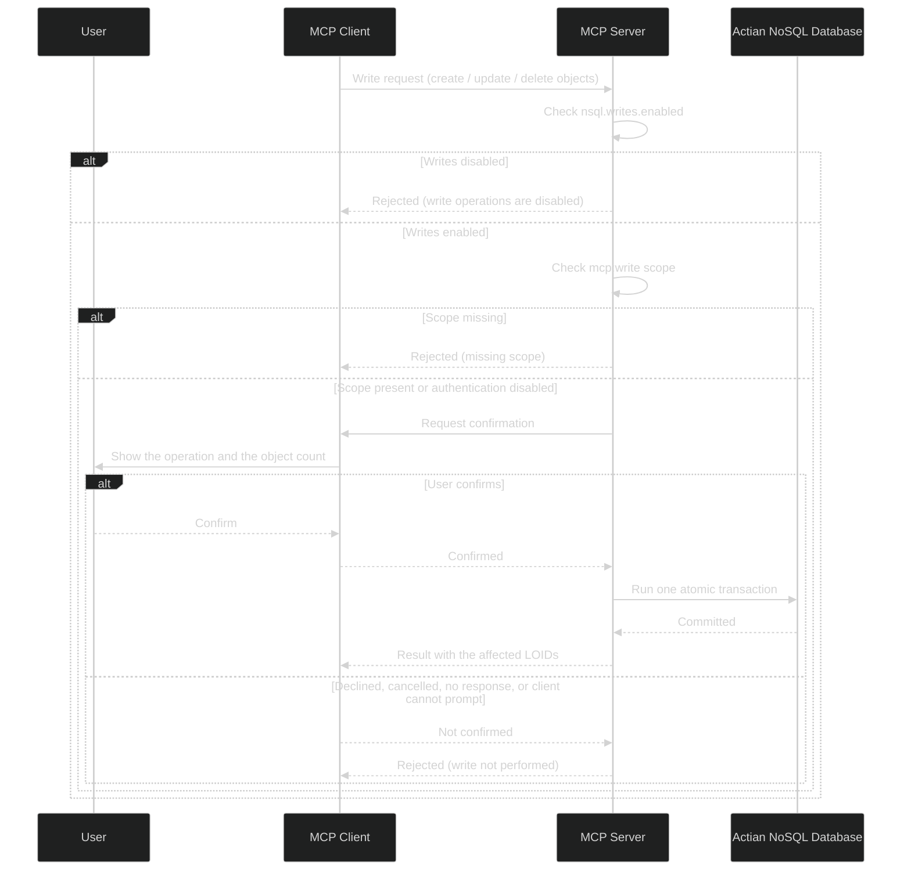

# Write support

The Actian MCP Server for Actian NoSQL is read-only by default. Setting `nsql.writes.enabled` to `true` adds three tools that change data: `create_objects`, `update_objects`, and `delete_objects`. A deployment that never sets it is untouched by everything on this page.

Turning writes on does not hand the connected AI agent free rein over your database. Every write clears three independent checks — the server setting, the caller's `mcp:write` scope, and a person confirming the operation — and each of them can stop it. This page covers all three, the properties that tune them, and what to do when the write tools do not appear in the client at all.

For each tool's parameters, batch limits, and result shape, see [Tools](tools/index.md). Tools contributed by an [extension](extensions/index.md) pass the same three checks.

!!! note "Writes are never expressed as JPQL"
    Enabling write mode does not change `execute_query`. It still accepts `SELECT` only, and still rejects anything that could modify state. Every mutation goes through one of the three write tools instead.

!!! note "Write mode does not change the schema"
    The write tools create, change, and remove *objects*; they cannot add a class, alter a class, or change an index. Use the tools that come with Actian NoSQL Database for schema changes.

## Enabling write mode

Set `nsql.writes.enabled` in `application.properties`:

| Value | Behavior |
|-------|----------|
| `false` | Default. The write tools are hidden from clients, and any call to one is rejected. |
| `true` | The write tools are registered, subject to the checks below. |

```properties
nsql.writes.enabled=true
```

As with every property on this server, the environment-variable form works too — `NSQL_WRITES_ENABLED=true` — and takes precedence over the file. The server has no hot reload for this setting: restart it after changing the value.

## How a write is authorized

Authorization happens at two separate moments: the server decides which write tools a client may have when that client connects, and then vets each call as it arrives.

### Which tools a client is given, at connect time

A write tool is registered for a connection only when **both** of these hold:

1. `nsql.writes.enabled` is `true`; and
2. the client advertised the MCP elicitation capability, so the server has a way to ask a person for confirmation.

The second condition is waived when `nsql.writes.confirmation-required` is `false` — with no prompt to show, there is no reason to withhold the tools from a client that could not show one.

A tool the server withholds is unlisted **and** uncallable: calling it anyway fails at the protocol layer with an unknown-tool error, before any server-side logic runs. If the write tools are missing when you expected them, [Why the write tools may not appear](#why-the-write-tools-may-not-appear) is the troubleshooting guide.

### What each call must clear

Every call that does reach the server passes three independent checks, in the order below — so a caller on a read-only server, or one whose token lacks the scope, is turned away before anybody is asked to confirm anything.

| Check | What it requires | When it applies |
|-------|------------------|-----------------|
| `nsql.writes.enabled` | The setting must be `true`. | Always. Re-checked here as a backstop, having already governed registration. |
| `mcp:write` scope | The access token must carry the `mcp:write` scope. | Only when authentication is enabled (`mcp.auth.enabled=true`). An unauthenticated server does not check scopes. |
| Human confirmation | A person must confirm the operation in the connected client. | Always, unless you disable it with `nsql.writes.confirmation-required`. |

The sequence below picks up at this second stage, with the tool already registered:



To grant the `mcp:write` scope in your identity provider, see [Auth0](authentication/auth0/index.md) or [Keycloak](authentication/keycloak/index.md).

!!! warning "The scope is the only per-caller write control"
    Actian NoSQL Database authenticates through the connection URL, so every statement the server runs — read or write — runs as that one configured database user. There is no per-user impersonation, and therefore no database-privilege backstop that could stop an authorized caller from changing a particular class.

    Grant `mcp:write` only to the callers that should be able to modify data, and treat the database user in `nsql.connectionURL` as the true limit of what any caller can reach.

## Confirmation prompts

The server requests confirmation through the Model Context Protocol (MCP) elicitation capability, and enforces the answer server-side. The write tool does not run until an explicit acceptance comes back — the client is never trusted to gate the operation on the server's behalf.

The prompt is a summary, not a transcript. It says what the operation will do and how many objects it affects, and stops there — field values and individual LOIDs are deliberately left out, so a hundred-object batch stays as readable as a one-object batch. Each tool's exact wording is shown with that tool in [Tools](tools/index.md).

Only an explicit confirmation lets the write proceed. Every other outcome rejects it:

| Outcome | Result |
|---------|--------|
| The user confirms | The write runs. |
| The user declines | Rejected. |
| The user cancels | Rejected. |
| The prompt is submitted without confirming | Rejected. |
| No response within `nsql.writes.confirmation-timeout-seconds` (default `60`) | Rejected. |
| The client cannot display prompts at all | Rejected. |

Nothing is written in any of those cases. The rejection message names the reason, so a declined write is distinguishable from one that timed out.

### How long the server waits

The clock starts when the prompt is sent and runs for `nsql.writes.confirmation-timeout-seconds`, 60 by default. Silence is not consent: when the window closes the write is rejected outright, and the tool call returns naming the reason.

```text
Create not performed: no confirmation was received within the timeout.
```

The server records the same event:

```text
WARN  Confirmation not received within 60s; rejecting operation.
```

Sixty seconds suits someone watching the conversation as it happens. Raise it when approvals go to a person who may be away from the screen — but note that the tool call stays open for the whole wait, so the agent making the request is blocked until somebody answers or the timeout closes it. Lower it if you would rather a batch fail fast than sit pending.

The timeout plays no part when `nsql.writes.confirmation-required` is `false`, because no prompt is sent.

Not every MCP client implements elicitation. For which clients can display the prompt, see [Connecting MCP Clients](../mcp-clients/index.md#elicitation-support-for-write-approval).

## Why the write tools may not appear

Write tools go missing because one of the two [registration conditions](#which-tools-a-client-is-given-at-connect-time) was not met. Withholding them is deliberate: a tool the server could never get confirmed would fail on every call, so a client that cannot confirm simply never sees one. The startup log tells you which condition to look at.

| What you see | Cause | What to do |
|--------------|-------|------------|
| No write tools, and the startup log says `Mode: READ-ONLY` | `nsql.writes.enabled` is `false`. | Set it to `true` and restart the server. |
| No write tools, but the startup log says `Mode: READ-WRITE` | The connected client did not advertise elicitation. | Connect a client that supports it, or set `nsql.writes.confirmation-required=false`. |
| A write tool call fails with a protocol error naming the tool, such as `-32602 Invalid tool name` | The tool is not registered for this connection, for one of the two reasons above. The MCP runtime rejects the call as unknown; it never reaches the server's write logic. | Fix the cause of the hiding, then reconnect the client so it re-reads the tool list. |
| A write tool call is rejected for a missing scope | The access token does not carry `mcp:write`. | Grant the scope in your identity provider. |

A hidden tool is unlisted **and** uncallable, so the usual sign of trouble is a protocol-level error about an unknown tool rather than a message from the server explaining itself. The server's own refusal, `Write operations are disabled on this server.`, is a backstop for a call that somehow bypasses the tool list; in normal use nobody sees it.

Visibility is decided per connection, from the capabilities the client advertised when it connected. After changing either setting, restart the server and reconnect the client.

This rule is not tied to specific tool names. It applies to any tool that does not declare itself read-only, including tools contributed by an [extension](extensions/index.md).

## Skipping the confirmation prompt

Some clients cannot display prompts. For those deployments, set `nsql.writes.confirmation-required` to `false`:

```properties
nsql.writes.enabled=true
nsql.writes.confirmation-required=false
```

!!! warning "This removes human oversight of every write"
    With `nsql.writes.confirmation-required` set to `false`, the server creates, updates, and deletes objects as soon as it is asked. Nobody is asked first. Use it only when the client cannot prompt and you accept that the AI agent writes unattended.

    The other two checks still apply. Disabling confirmation does not enable writes, and it does not grant write access to callers that lack the `mcp:write` scope.

    This setting is deployment-wide: it applies to the built-in write tools **and** to any extension tool that asks for confirmation. Both share the same confirmation mechanism, so turning it off silences both.

The setting is visible in the log. At startup the server records the mode it is running in, and it raises that line to a warning when writes are unconfirmed:

```text
WARN  nsql-mcp-server Mode: READ-WRITE. Write tools are exposed; writes execute without confirmation.
```

## Optimistic concurrency

Every object a read returns carries a `version` field: an opaque token that changes whenever the object is modified. It is returned as a string so that large values survive JSON without losing precision. Do not parse it or compare it for ordering — the only thing to do with it is hand it back.

`update_objects` requires it. Each update item carries the target `loid`, the `expectedVersion` you read earlier, and the `fields` to change:

```json
{
  "loid": "135.0.2146",
  "expectedVersion": "8273401",
  "fields": { "department": "Research" }
}
```

The update is applied only if the object has not changed since you read it. If it has, the call fails — and because a write is one all-or-nothing transaction, a single stale version fails the whole batch, leaving every object in it untouched. Re-read the affected objects to obtain their current `version`, then retry.

See [Tools](tools/index.md) for where `version` appears in each read tool's response.

## Configuration reference

| Property | Default | Description |
|----------|---------|-------------|
| `nsql.writes.enabled` | `false` | Master switch for the write tools. While `false` they are hidden from clients and every call to one is rejected. |
| `nsql.writes.max-batch` | `100` | Maximum number of objects a single write call may touch in one transaction. A larger batch is rejected; split it. |
| `nsql.writes.confirmation-required` | `true` | Whether a write must be confirmed by a person. Deployment-wide: applies to built-in and extension write tools alike. |
| `nsql.writes.confirmation-timeout-seconds` | `60` | How long the server waits for a confirmation before rejecting the write. |

## Next Steps

<div class="grid cards" markdown>

- :material-tools: **[Tools](tools/index.md)**  
  The three write tools, their parameters, batch limits, and result shapes.

- :material-puzzle: **[Extensions](extensions/index.md)**  
  Add your own tools, including write tools, subject to these same checks.

- :material-lock: **[Authentication](authentication/index.md)**  
  Enable OAuth 2.0 and grant the `mcp:write` scope.

- :material-connection: **[MCP clients](../mcp-clients/index.md#elicitation-support-for-write-approval)**  
  Which clients can display the confirmation prompt.

</div>
